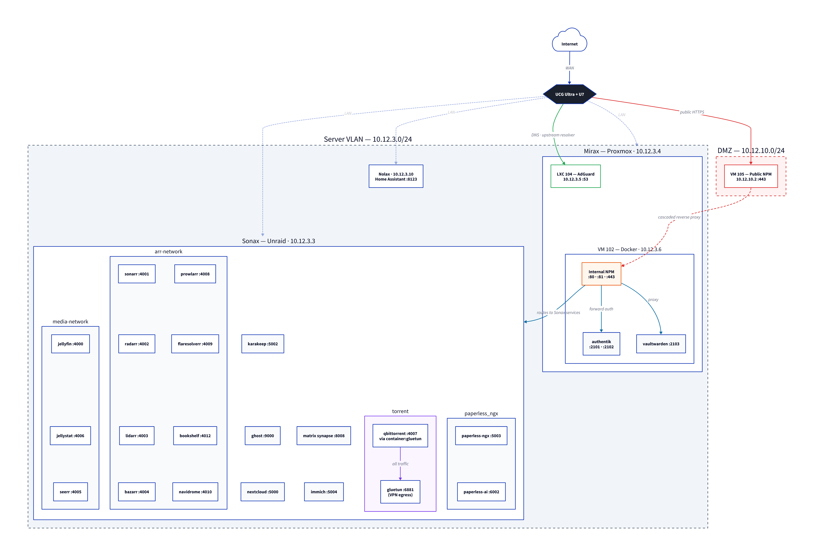

# Homelab

A small, personal corner of the internet

📑 Read the blogpost: [A Deep Dive into My Homelab: Story and Software](https://infinitive.cc/blog/a-deep-dive-into-my-homelab-story-and-software/)



---

## Docker Compose YAMLs

Featuring over 25 Docker images across ready-to-deploy Compose files. Full setups with in-container networking ready.

### Deployment

```
mkdir homelab-[service]
cd homelab-[service]
curl -O https://raw.githubusercontent.com/infinit1ve/homelab/refs/heads/main/Docker%20Compose/[service].yaml
mv [service].yaml docker-compose.yaml
# edit docker-compose.yaml with your values
sudo docker compose up -d
```

**Full image list:**

- Full arr stack
  - Sonarr
  - Radarr
  - Lidarr
  - Bazarr
  - Bookshelf
  - Media Servers
    - Navidrome
    - Jellyfin
      - Jellystat
      - Seerr
  - Explo
  - Torrenting setup
    - Gluetun
    - qBitTorrent
  - FlareSolvarr
  - Prowlarr
- Authentik
- Ghost
- Immich
- Journiv
- Karakeep
- Matrix
- NPM Manager
- Paperless-ngx
  - Paperless-ai
- Vaultwarden
  - Bitwardenportal
- Monero Farmer
- FLAC to MP3 converter

## Disclaimer

This repo is a personal backup. Use it responsibly and in accordance with the laws in your country. For issues with specific services or images, reach out to the respective project communities.
